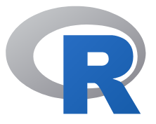
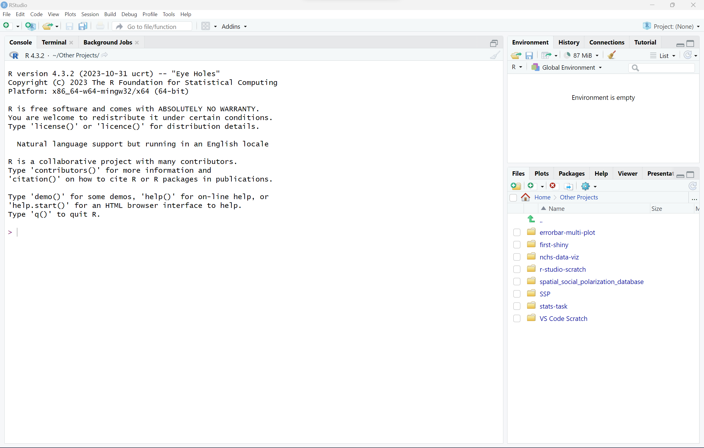
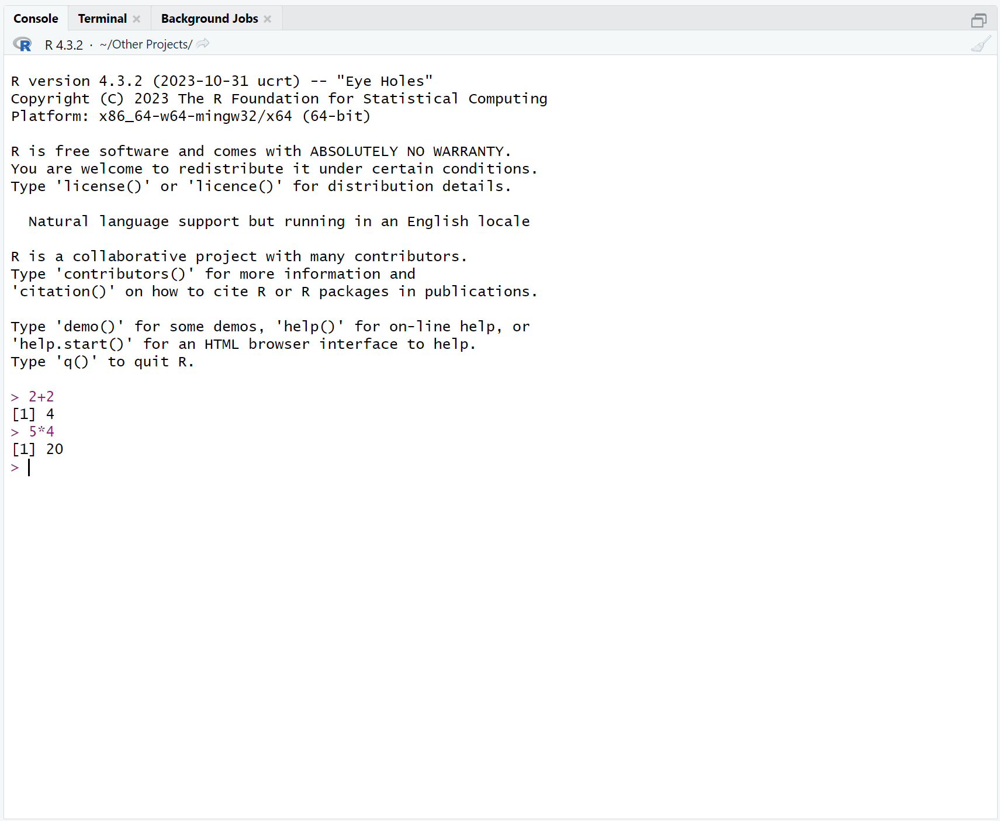
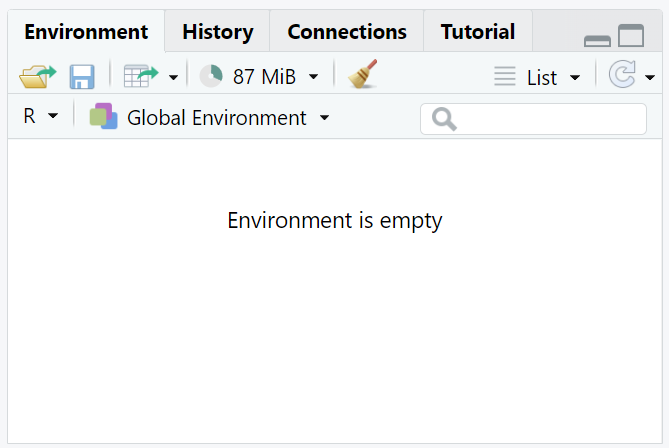
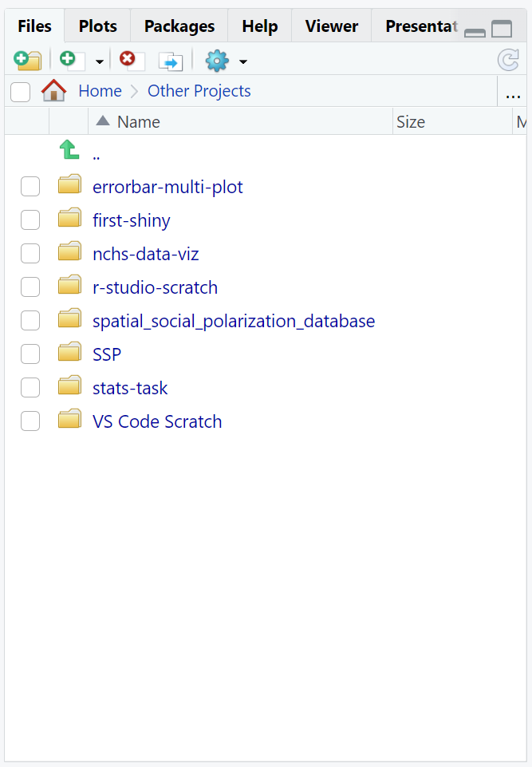
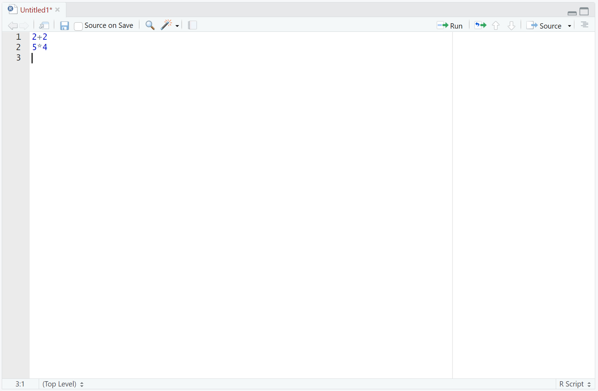

```{r setup, include=FALSE, show=FALSE}
library(knitr)
opts_chunk$set(tidy.opts=list(width.cutoff=80),tidy=TRUE)
```

**Introduction**

For this tutorial, we need to use R, RStudio, and the Census API. If you have already worked with R and R Studio, you can skip directly to [Step 4: Get a Census API Key](#api).

Just a quick definition of terms:

**R** - R is a program that runs on your computer to process data, run analyses, make figures, and do much, much more. You can run R on its own, but it is all text-based. When something is text based, it is sometimes hard to stay organized.

**RStudio** - RStudio is a program that runs on top of R. It gives you a nice, pretty work environment. It makes it easy to see the code you are writing, how R is running, any images you have created, what variables you have stored, and much more! Working in R without RStudio is possible and happens in large data centers, but RStudio makes life much easier.

**Census** - The United States Census Bureau is the government organization in charge of the national census of every person in the Uunited States every 10 years as [required by the US Constitution](https://www.census.gov/programs-surveys/decennial-census/about/census-constitution.html). They also carry out many other surveys that estimate different demographic facts about the United States population. The most relevant survey for our use is the American Community Survey (ACS) which is a random in-depth survey of 100,000 people every year. They use this survey to produce the ACS 1-year estimates of race, age, gender, employment, income, and many other demographic factors. They also group 5 years of surveys together to produce more robust estimates of these values in the ACS 5-year estimates.

**API** - Application Program Interfaces (APIs) allow code to interact with websites without going through the human-friendly version. Web providers like this because it costs less to respond to a simple API request than load a whole webpage. Coders like them because we can write code to request a bunch of data without clicking through the webpage.

# Step 1: Install R



a.  You will want to do all of this installing on a laptop that you can bring to class.

b.  To install R, you will use the [Comprehensive R Archive Network (CRAN)](https://cran.r-project.org/). Click on that link or type cran.r-project.org into your browser.

c.  At the top of this website, you will see a list of installation links.

-   **If you are using Mac:** Click the link that says `Download R for macOS`. You will see a page with download links that start with `R-` and end with `.pkg`. If you have a newer Mac that uses Apple's processors (M1, M2, etc.), you will use the first link under the text `For Apple silicon`. If you have an older Mac that uses an Intel processor, you will use the link under `For older Intel Macs`. If you're not sure which one you have, [here's a nifty tutorial](https://help.arcstudiopro.com/all-how-tos/how-do-i-know-if-my-mac-has-intel-processor-or-apple-m1) on how to find that information on your computer.
-   **If you are using Windows:** Click the link that says `Download R for Windows`. Then, click on `base`. Then, click on `Download R for Windows`.
-   **If you are using Linux:** Click the link that says `Download R for Linux`. Then, select the distro you are using from the list. These links will bring you to a distro-specific tutorial for the commands need to download R.

d.  After you have downloaded the correct file for your system, click on it. If you cannot find the file, check your "Downloads" folder or try step c again. It may take a little while for the file to download and install. After you click on it, you may need to say "Yes" to allow the file to be installed on your computer. Click through the installer using the default options. Eventually, the installer will say that R was successfully installed, and you should see R on your computer.

# Step 2: Install RStudio


a.  To install RStudio, you can click on [this link](https://posit.co/download/rstudio-desktop/) or go to posit.co/download/rstudio-desktop in your browser.

b.  Since we already installed R in the above step, you can use the button under **2: Install RStudio** to get RStudio for your computer. The website should automatically detect what system you're using and give you the right one, but all of the different installers are available on the page if you scroll down.

c.  When it's done downloading, click on the installer and follow the prompts. You may have to click "Yes" to allow it to run on your computer. Keep following the prompts using the default options until you finish the installation. Then, open RStudio by clicking on it.

# Step 3: Check your work & take an RStudio Tour

a.  Click on RStudio to open it. It should look something like this:



If your RStudio does not look similar when you open it up, revisit steps 1 & 2 to see if something went wrong in the install. If you're having trouble, please feel free to use office hours, email, or the internet to get help with your installation.

b.  Let's look around RStudio. The big section on the left hand side is the R console. When you downloaded R in step 1, that is what you downloaded! It has all of the power of R, and everything else on your screen is just trying to make your life easier. The `>` means that R is ready to accept a command. Feel free to click in there and ask it some math problems like `2+2` or `5*4` just to make sure it is really working. You can see at the top of that big pane are the tabs "Console", "Terminal", and "Background Jobs". We will only be using the "Console" in this class, but it is good to know that there are other things there!



*Note:* Depending on when you read this, the top line may not say `R version 4.3.2 (2023-10-31 ucrt) -- "Eye Holes"`, especially if you're reading this in the way future!!! The top line will always be the R version you are running. As long as it says `R version` and then some numbers, you are good to go.

c.  The top right pane is our "Environment". This pane tells us about what we are working on in this project. When you save data sets or create variables, they will appear here in case you forget their names or what they contain. You can see there are other tabs in this pane too, but we will not use them in this course.



d.  The bottom right pane has a lot of useful stuff in it. We will go through several of these in the course as they can be really helpful when you are making figures or need help. The tab you are probably looking at now is "Files" which is useful to save and open your code. We will be talking a look at this pane during week 1.



*Note:* Your files will not be the same as mine. However, you should have the same tabs at the top.

e.  There is actually a hidden 4th pane that appears when you are working on editing a file. Let's create a new file to see that pane. In the top left hand corner of RStudio, click on File \> New File \> R Script. A new pane should appear above the Console. You can use this pane to write your code and save it for future use. Go ahead and add the same lines `2+2` and `5*4` to this new file, and use the "Run" button for each line to send them to the Console.



**Congratulations!** You have installed R and RStudio, and you are ready to code in R.

# Step 4: Get a Census API Key {#api}

If you skipped here from the top because you already have R and R Studio installed, now is a good time to make sure you have updated versions of [R](https://cran.r-project.org/) and [RStudio](https://posit.co/download/rstudio-desktop/).

a.  Go to [api.census.gov/data/key_signup.html](https://api.census.gov/data/key_signup.html).

b.  Fill out the organization name, email, agree to the terms, and click "Request Key".

c.  You will get an email with your Census Data API key. It will be a 40-digit series of numbers and lower-case letters.

d.  Save this email for use in the exercises. This key is how we will tell the Census who is requesting the data.

**Note about API keys:** API keys are a singular way that programs identify you and should be treated like a password or a social security number. If anyone gets this key, they can easily pretend to be you. With the Census, they monitor these keys and will simply disable them if you make too many requests. If you have an API key for a private data source or a system that costs money, a bad actor could steal the data or rack up huge resource costs that you will be on the hook for. ***Protect your key!!*** You should never upload your key to the internet, like through Github. You should never give your key to someone else to use, even a trusted coworker. 1 key per person per computer!
